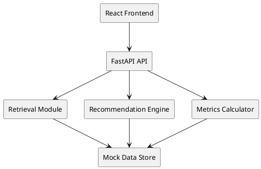

<div align="center">

# POI Compass
**Project Orientation Intelligence Tool** – Compresses onboarding time and eliminates context drift for large (500+) project teams.

[](./prd.md) []() []() []() []()

</div>

## 1. Executive Snapshot
POI Compass provides an authoritative, queryable project overview, org structure explorer, role responsibility lookup, high‑accuracy Q&A, team placement recommendations, and a canonical quiz ensuring 100% factual alignment. Demo targets a ≥60% reduction in orientation time (Baseline 56h → Tool 20h) with zero tolerance for quiz inaccuracies.

## 2. Why It Matters
Large programs suffer onboarding drag and context decay. New contributors become busy yet misaligned. POI Compass accelerates time-to-context and provides measurable compression, improving early productivity and leadership confidence.

## 3. North Star Metric
**Orientation Compression (%)** = `(Baseline_Time - Tool_Time) / Baseline_Time * 100`  
Demo Example: `(56 - 20) / 56 * 100 = 64.29%` → PASS (≥60%).  
Supporting Metrics: Comprehension Score (quiz accuracy), Confidence Coverage (answers ≥0.85), Recommendation Accuracy.

## 4. Core Features
| Feature | Endpoint | Description |
|---------|----------|-------------|
| Project Overview | `GET /overview` | Mission, problem, strategic summary |
| Org Explorer | `GET /org` | Hierarchical team + responsibilities |
| Role Lookup | `GET /roles?query=` | Fuzzy responsibility search |
| Q&A | `POST /qa` | Deterministic fact retrieval + confidence |
| Recommendation Engine | `POST /recommendation` | Team placement + rationale |
| Canonical Quiz | `GET /quiz`, `POST /quiz/submit` | 15 questions, must be 100% accurate |
| Metrics Dashboard | `GET /metrics` | Compression %, quiz accuracy, coverage |
| Gap Detection | `GET /gaps` | Missing / stale fact simulation |

## 5. Demo Success Criteria (Zero Tolerance)
1. Compression ≥ 60%.  
2. Quiz Score = 15/15 (100%).  
3. All canonical Q&A answers confidence ≥ 0.85.  
Failure on any → demo goal not met.

## 6. Architecture Overview
Monolithic FastAPI backend + React frontend consuming REST endpoints over a mock data layer. Retrieval uses keyword overlap heuristic (upgrade path to embeddings). Recommendation engine rule-based with transparent scoring.



## 7. Data Model (Mock)
Entities (stored as JSON / optional SQLite): `User`, `Team`, `ProjectFact`, `QuizQuestion`, `InteractionEvent`, `Recommendation`.
Example Team object:
```json
{
  "id": "T12",
  "name": "Identity & Access",
  "mission": "Secure authentication and authorization services",
  "responsibilities": ["SSO integration", "IAM policy reviews"],
  "parent_team_id": "T01"
}
```

## 8. Installation & Setup
Prerequisites: Python 3.11+, Node.js (latest LTS), Docker (optional).

### Backend
```bash
python -m venv .venv
source .venv/bin/activate  # Windows: .venv\Scripts\activate
pip install -r requirements.txt  # (to be created)
uvicorn app.main:app --reload
```

### Frontend
```bash
cd frontend  # (folder to be scaffolded)
npm install
npm start
```

### Docker (Optional)
```bash
docker compose up --build
```

### .env Example
Create `.env`:
```
LLM_API_KEY=placeholder
EMBEDDING_API_KEY=placeholder
ENV=demo
```
(Not consumed in demo logic; reserved for future enhancements.)

## 9. Testing (Planned)
Planned initial test suite:
| Test | Purpose |
|------|---------|
| `test_metrics_compression.py` | Validates compression calculation |
| `test_quiz_accuracy.py` | Ensures 100% canonical answer mapping |
| `test_recommendation_scoring.py` | Score normalization + confidence threshold |
| `test_retrieval_confidence.py` | Q&A heuristic meets ≥0.85 for canonical questions |

Run (after creation):
```bash
pytest -q
```

## 10. AI Usage & Guardrails
Allowed: summary phrasing, rationale templates, quiz question refinement, alternative wording.  
Prohibited: real employee data, PHI, unlicensed external code, speculative facts.  
Confidence < 0.85 → fallback response: "Consult Mentor" (canonical dataset avoids triggering).  
Prompt templates versioned in `prompts.md`.

### Example Prompt (Overview Summarizer)
```
You are a technical product analyst. Using the mission:<mission_statement> and problem:<problem_statement> plus team count <team_count> and key responsibilities list <responsibilities_list> ... (see prompts.md)
```
More prompts: see `prompts.md`.

## 11. ADRs
- ADR 0001: Metric Choice & Baseline Simulation (`adr-0001-metric-choice.md`)
Future ADRs: Retrieval Upgrade, Data Ingestion Strategy, Access Control Model.

## 12. Roadmap (High-Level)
Phase 2: Real HRIS & ticketing ingestion.  
Phase 3: Adaptive learning paths + personalized gap analysis.  
Phase 4: Embeddings / semantic retrieval + calibrated confidence.  
Phase 5: Integration with time-to-first-productive-commit KPI.

## 13. Demo Scenario Narrative
"New hire joins a sprawling program. Previously took a week of scattered chats and doc spelunking. With POI Compass: overview (2 min), org exploration (3 min), quiz (100% in 4 min), team recommendation with rationale—orientation compressed to under half-day equivalent."  
Visual: Metrics dashboard bar (Baseline 56h vs Tool 20h) + quiz completion badge.

## 14. Known Limitations
- Baseline time simulated; real-world recalibration needed.
- Heuristic retrieval may mis-rank semantically similar phrasing.
- Rule-based recommendations lack dynamic skill inference.
- No real access control / RBAC yet.
- Scaling model (500 concurrent) not load-tested.

## 15. Data Privacy & Compliance (Forward-Looking)
Demo excludes PHI and personal identifiers. Future phases will incorporate HIPAA review, RBAC, audit logging, and encryption at rest for sensitive metadata.

## 16. Contribution Policy
Internal use only; external contributions disabled. New decisions require ADR with: Context, Options, Decision, Consequences, Review Date.

## 17. Traceability
Canonical quiz questions map directly to `ProjectFact` IDs; tests will enforce deterministic linkage. Full matrix in `prd.md`.

## 18. Glossary (Excerpt)
- Canonical Fact: Authoritative statement forming quiz & Q&A basis.
- Orientation Compression: % reduction in time to validated project understanding.
- Confidence Coverage: Portion of answers above heuristic threshold.

## 19. Resources
| Artifact | Purpose |
|----------|---------|
| `prd.md` | Detailed product specification & acceptance criteria |
| `prompts.md` | Versioned AI prompt library |
| `adr-0001-metric-choice.md` | Metric selection rationale |
| `CAPSTONE_README.md` | Archived original capstone instructions |

## 20. License
Internal Use Only – Not for external distribution.

## 21. Status & Revision
| Version | Date | Change |
|---------|------|--------|
| 0.1 | 2025-11-05 | Initial project README creation |

---
For deeper context: consult `prd.md`. For prompt updates: amend `prompts.md` and increment version header.
