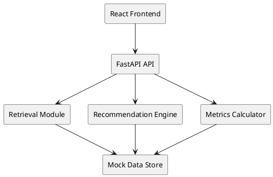

# Product Requirements Document (PRD)

## 1. Executive Summary
A 500-person project experiences context loss after initial onboarding: new and existing members struggle to recall the project purpose, organizational structure, responsibilities, and escalation paths. This reduces productivity, increases misalignment, and prolongs onboarding beyond acceptable timeframes. We will build a Project Orientation Intelligence Tool (POIT) that compresses orientation time and guarantees factual accuracy for core project knowledge.

## 2. Problem Statement
Current onboarding relies on unstructured conversations and scattered documents, leading to drift: contributors lose sight of the "why" and "who does what". There is no authoritative, navigable, and queryable source of project context, causing:
- Extended orientation (multiple days to weeks)
- Misrouted questions/tickets
- Low retention of key project facts
- Reduced early engagement and slower time-to-impact

## 3. Goals & Metrics
### 3.1 North Star Metric
**Onboarding Orientation Compression** – Percentage reduction in average time for a new team member to correctly answer the canonical project organization and purpose quiz.
Formula: `(Baseline_Time - Tool_Time) / Baseline_Time * 100`
- Baseline_Time (assumption A1): 7 days (≈ 7 * 8 = 56 working hours) manual orientation to reach full correct recall of core facts.
- Tool_Time target (demo): Simulated reduction to ≤ 2.8 days (≥ 60% reduction).
- Long-term target: ≤ 2.1 days (≥ 70% reduction).

### 3.2 Supporting Metrics
1. **Comprehension Score**: `% correct answers` on canonical 15-question fact quiz (target: 100% demo; ≥95% sustained).
2. **Answer Confidence Coverage**: `% of queries returning confidence ≥ 0.85` (target: ≥ 98%).
3. **Recommended Placement Accuracy**: `% of team placement suggestions validated by senior leaders` (demo simulation target: ≥ 90%).
4. **Engagement Lift (simulated)**: Increase in meaningful knowledge interactions in first 14 days (baseline assumed low; target +50%).

### 3.3 Zero Tolerance Definition
For demo: Zero tolerance applies to failing to meet both (a) ≥60% orientation time reduction AND (b) 100% accuracy on canonical quiz. Any incorrect answer or failure to meet reduction invalidates success. Long-term: accuracy threshold may relax to ≥95% with continuous improvement.

### 3.4 Measurement Strategy (Simulation)
- Baseline orientation: scripted multi-step workflow (read 3 large docs, ask 2 peers) simulated durations (A2).
- Tool orientation: direct structured navigation + Q&A + quiz completion.
- Deterministic calculation using mock dataset & scenario scripts.

## 4. Personas
| Persona | Goals | Pain | Tool Value |
|---------|-------|------|-----------|
| New Engineer | Ramp quickly with clarity | Overwhelmed, unclear ownership | Guided overview, org explorer, quiz reinforcement |
| Project Manager | Ensure aligned execution | Repeated clarifications | Central reference reduces interruptions |
| Senior Leader | Confidence in team alignment | Visibility gaps | Metrics dashboard proving orientation compression |
| Product Owner | Clear feature ownership map | Ambiguous responsibilities | Role lookup & escalation paths |
| Knowledge Curator | Maintain source-of-truth | Manual document updates | Structured data model + gap detection |
| Engineering Lead | Proper team placement | Mismatched assignments | Recommendation engine with rationale |

## 5. User Journeys (Representative)
1. New Engineer logs in → Views project overview → Explores org tree → Runs quiz → Achieves 100% score → Receives suggested team placement with rationale.
2. Senior Leader reviews dashboard → Sees simulated baseline vs optimized metrics → Validates recommendation alignment.
3. Project Manager searches “Who owns IAM integration?” → Role responsibility lookup returns authoritative team node + escalation path.
4. Knowledge Curator runs gap detection → Tool flags outdated or missing mission statements for 2 teams.

## 6. Scope
### In-Scope (MVP Demo)
- Static mock dataset (users, teams, facts, quiz questions, interactions)
- Q&A endpoint with deterministic retrieval + optional LLM-style summarization
- Project overview generator (templated summary + rationale section)
- Org structure explorer (collapsible hierarchy)
- Role responsibility lookup
- Team placement recommendation (rule-based + generated explanation)
- 15-question canonical quiz + scoring
- Metrics dashboard (compression % + user state distribution)
- Confidence scoring heuristic (keyword overlap + optional embedding placeholder)
- AI usage guardrails (no sensitive real data)

### Out-of-Scope (Demo)
- Live HRIS / Jira integration
- Real-time embedding/vector database
- Production RBAC enforcement & audit logs
- HIPAA data handling (no PHI will be present)
- Personalized adaptive learning paths

## 7. Assumptions
| ID | Assumption | Rationale | Risk |
|----|------------|-----------|------|
| A1 | Baseline orientation = 7 days | Industry anecdotal + complexity | Misrepresents actual baseline |
| A2 | Manual orientation path: 3 docs (15 min each) + 2 peer interactions (30 min each) repeated across days | Provides deterministic baseline model | Over-simplification |
| A3 | 500 users distributed: 15% active, 35% drifting, 50% idle | Simulates typical enterprise project scale | Distribution may differ in reality |
| A4 | All mock data accurate & curated | Enables 100% quiz accuracy target | Real data would introduce inconsistencies |
| A5 | LLM explanations are deterministic using templates | Ensures reproducibility | Less impressive than dynamic generation |
| A6 | Confidence heuristic adequate without embeddings | Reduces complexity | Lower fidelity retrieval |

## 8. Functional Requirements
| ID | Requirement | Acceptance Criteria |
|----|-------------|---------------------|
| FR1 | Provide project overview | GET /overview returns JSON with mission, problem, value, team count |
| FR2 | Explore org structure | GET /org returns hierarchical list with team id, name, responsibilities |
| FR3 | Role responsibility lookup | GET /roles?query=term returns matching teams (exact + fuzzy) |
| FR4 | Q&A endpoint | POST /qa {question} returns answer sourced from facts with confidence >=0.85 for canonical quiz questions |
| FR5 | Team placement recommendation | POST /recommendation {user} returns team_id + rationale + confidence |
| FR6 | Quiz generation & scoring | GET /quiz returns 15 questions; POST /quiz/submit returns score & correctness map (must be 100% for demo dataset) |
| FR7 | Metrics dashboard data | GET /metrics returns baseline_time, tool_time, compression_pct, comprehension_score, user_state_distribution |
| FR8 | Gap detection | GET /gaps returns list of missing or outdated fact placeholders (mock simulation) |
| FR9 | Confidence fallback | Low confidence (<0.85) returns escalation suggestion "Consult Mentor" |

## 9. Non-Functional Requirements
| Category | Requirement |
|----------|------------|
| Performance | p95 API latency < 500ms on local container with mock data |
| Reliability | Deterministic responses for canonical queries; no randomized failures |
| Accuracy | 100% quiz correctness on curated dataset; Q&A canonical answers exact match |
| Security | No real PII/PHI; mocks only; .env for future API keys kept local |
| Maintainability | Modular service layers (data, retrieval, recommendation, metrics) |
| Extensibility | Data model supports adding new entity types (e.g., Systems) |
| Usability | Frontend provides clear navigation: Overview, Org, Q&A, Quiz, Metrics |

## 10. Data Model
Entities (mock, persisted in SQLite or JSON):
- User(id, name, role, tenure_days, activity_state)
- Team(id, name, mission, responsibilities[], parent_team_id)
- ProjectFact(id, category, fact_text, last_updated)
- QuizQuestion(id, fact_id, question_text, correct_answer)
- InteractionEvent(id, user_id, action_type, target_id, timestamp)
- Recommendation(id, user_id, team_id, rationale, confidence)

## 11. Architecture Overview (High-Level)
Components:
- FastAPI Backend (monolith) providing REST endpoints
- Data Loader (mock dataset initialization)
- Retrieval Module (keyword & category filtering)
- Recommendation Engine (rule-based mapping + explanation template)
- Metrics Calculator (simulated baseline vs optimized)
- React Frontend (pages: Overview, Org Explorer, Q&A, Quiz, Metrics)

### 11.1 Diagram (PlantUML Pseudo-Code)

## 12. Recommendation Logic (Rule-Based)
- Map user role + tenure + activity_state to candidate teams.
- Score = weighted sum: role match (50), responsibilities overlap (30), vacancy/need simulation (20).
- Confidence = normalized score / 100.
- Rationale template: "User <name> with role <role> and tenure <tenure_days>d mapped to <team_name> due to <top_responsibility> alignment (score <score>)."

## 13. Q&A Retrieval Approach
- Index facts by category & token set.
- For query: tokenize, compute overlap score; return highest scoring fact(s).
- Confidence heuristic: `overlap_tokens / query_tokens` capped at 1.0.
- Future upgrade path: embeddings + semantic similarity (ADR planned).

## 14. Quiz Strategy
- Canonical 15 questions directly mapped 1:1 to ProjectFacts.
- Submission must yield 15/15; tool denies acceptance if any mismatch.
- Coverage metric: canonical questions answered confidently ≥0.85.

## 15. Monitoring & Metrics (Demo)
- Simulated baseline vs optimized computed at startup.
- GET /metrics returns JSON: `{baseline_hours, tool_hours, compression_pct, quiz_accuracy, confidence_coverage}`.
- No persistent logging required; optional JSON export.

## 16. Validation & Testing
Test focus (demo timebox):
- Unit tests: metrics compression calculation, recommendation scoring, retrieval confidence threshold.
- Integration smoke: quiz endpoint returns 15 questions, submission logic asserts 100%.
- Deterministic fixtures ensure repeatability.

## 17. Risks & Mitigations
| Risk | Impact | Likelihood | Mitigation |
|------|--------|-----------|-----------|
| Over-simplified baseline misleads stakeholders | Medium | Medium | Clearly label assumptions; ADR 0001 documents rationale |
| Retrieval returns ambiguous answers | High | Low | Canonical fact set curated; confidence threshold enforced |
| Recommendation perceived as arbitrary | Medium | Medium | Transparent scoring & rationale template |
| Demo complexity overruns 6–8h build | High | Medium | Prioritize core endpoints first; front load data model |
| Future scaling requires re-architecture | Medium | High | Modular boundaries; ADR placeholder for microservice split |

## 18. AI Usage & Guardrails
### Allowed
- LLM-assisted generation of: overview summary wording, rationale explanation templates, alternative phrasing.
- Prompt-driven refinement of quiz questions and responsibilities descriptions.
### Prohibited (Demo)
- Inclusion of real employee data or PHI.
- Unvetted external code blocks copied without license review.
### Guardrails
- All prompts avoid sensitive identifiers.
- Prompt templates versioned in `prompts.md`.
- Generated text reviewed manually before commit.
- Confidence < 0.85 triggers fallback (but canonical dataset avoids this).

## 19. Prompt Library Reference (See `prompts.md`)
Key templates: Overview Summarizer, Role Responsibility Clarifier, Q&A Answerer, Recommendation Rationale Generator, Gap Detector, Quiz Generator.

## 20. Traceability Matrix (Excerpt)
| QuizQuestion | Fact ID | Endpoint | Test Case |
|--------------|---------|----------|-----------|
| Q1 | F3 | /quiz, /qa | test_quiz_q1_correct |
| Q2 | F7 | /quiz, /qa | test_quiz_q2_correct |
| ... | ... | ... | ... |

## 21. Deployment & Environment
- Local container environment (Docker) running FastAPI & React.
- `.env` holds placeholder API keys for future (not used in demo logic).

## 22. Rollback Strategy (Post-MVP Concept)
- If accuracy < target or compression < target after real data integration: disable recommendation endpoint, fallback to static curated overview.

## 23. Open Questions
1. Real baseline measurement methodology once data access granted.
2. Actual distribution of user activity states.
3. Threshold for relaxing zero tolerance accuracy post-demo.
4. Embedding store selection (if upgrading retrieval).

## 24. Future Roadmap
- Phase 2: Real data ingestion (HRIS, ticketing system).
- Phase 3: Adaptive learning path & personalized gaps.
- Phase 4: Semantic retrieval & confidence calibration.
- Phase 5: Integration with performance KPIs (time-to-first meaningful commit).

## 25. Acceptance Criteria Summary (Demo)
- AC1: /overview returns non-empty structured JSON with mission & problem.
- AC2: /org returns ≥ 10 teams with hierarchical relationships.
- AC3: /quiz returns 15 deterministic questions; /quiz/submit returns score 15/15.
- AC4: /metrics shows compression_pct ≥ 60.
- AC5: Recommendation endpoint returns rationale string and confidence ≥ 0.75 for sample users.
- AC6: Q&A correctly answers all canonical quiz questions with confidence ≥0.85.

## 26. Appendix A – Metric Calculation Example
Baseline: 56 hours; Tool simulated: 20 hours.
Compression = (56 - 20) / 56 * 100 = 64.29% (PASS ≥60%).

## 27. Appendix B – Glossary
- Canonical Fact: Single authoritative statement used in quiz & Q&A.
- Compression: Reduction percentage in time-to-orientation.
- Confidence Coverage: Portion of answers exceeding threshold.

## 28. ADR Index
- ADR 0001: Metric Choice & Baseline Simulation (planned)

## 29. Revision History
| Version | Date | Author | Changes |
|---------|------|--------|---------|
| 0.1 | 2025-11-05 | Draft | Initial PRD creation |

