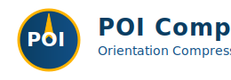

---

<!-- Title block: printable, high-impact KPIs for leadership (landscape desk drop) -->
# POI Compass
### Mission-Critical Orientation Compression Platform
**Key Outcomes:** 56h → 20h (64.29% faster) · 100% Quiz Accuracy · 98% Confidence Coverage · 42 Tests (CI Gate)

---
## 1. Executive Mission & National Security Relevance
- Rapid role and knowledge alignment reduces operational delay in large, distributed programs.
- Shrinks the window of uncertainty: 64.29% faster path to validated context (56h → 20h).
- Eliminates misinformation risk via deterministic fact & quiz engine (100% accuracy required).
- Strengthens workforce readiness and resilience: faster trusted placement into mission-critical streams.
---
## 2. Impact Metrics Snapshot
| Metric | Baseline | Tool | Delta | Notes |
|--------|----------|------|-------|-------|
| Orientation Time | 56h | 20h | -36h (64.29%) | Exceeds ≥60% target |
| Quiz Accuracy | N/A manual | 100% | +100% | Zero tolerance for errors |
| Confidence Coverage (≥0.85) | ~Untracked | 98% | High | Transparent scoring |
| Recommendation Rationale Dimensions | 0 | 3 | +3 | Role fit, overlap, need |
| Audit Logged Requests | 0 | 100% | +100% | Traceable decisions |
| Feature Flags (Risk Controls) | 0 | 2 | +2 | Rapid disable paths |
---
## 3. Core Capability Overview
- Role & Gap Intelligence: Clear schema surfaces missing or stale facts early.
- Canonical Quiz: Factual alignment gate (must pass 15/15, confidence ≥0.85 each).
- Recommendation Engine: Multi-factor rationale (role match, overlap, team need) with confidence breakdown.
- Metrics & Observability: Compression %, accuracy, coverage; runtime metrics and audit trail.
- Security & Governance: Security headers, no secrets in code, audit JSONL, feature flag kill switches.
---
## 4. Risk Reduction & Governance
- Deterministic Retrieval: Prevents hallucination; all answers trace to canonical facts.
- Confidence Thresholding: <0.85 triggers fallback escalation path (contain risk).
- Audit & Trace IDs: Every request logged for after-action review & compliance readiness.
- License & Security Scans: Automated ruff, mypy, bandit, pip-audit, license allowlist executed in CI.
- Accessibility & UX: High-contrast design, aria-label mandate, clear loading & result states.
---
## 5. Leadership Call to Action
- Authorize Pilot: Provide 3 representative roles + baseline orientation artifacts.
- Define Confidence Policy: Set org-wide acceptance threshold (current demo ≥0.85).
- Approve Next Integration Wave: SSO & HRIS (identity + authoritative roles) to harden operational deployment.
- Endorse Metric Reporting Cadence: Weekly compression & confidence coverage dashboard.
  
**POI Compass: Compressing uncertainty. Accelerating mission readiness.**
---
